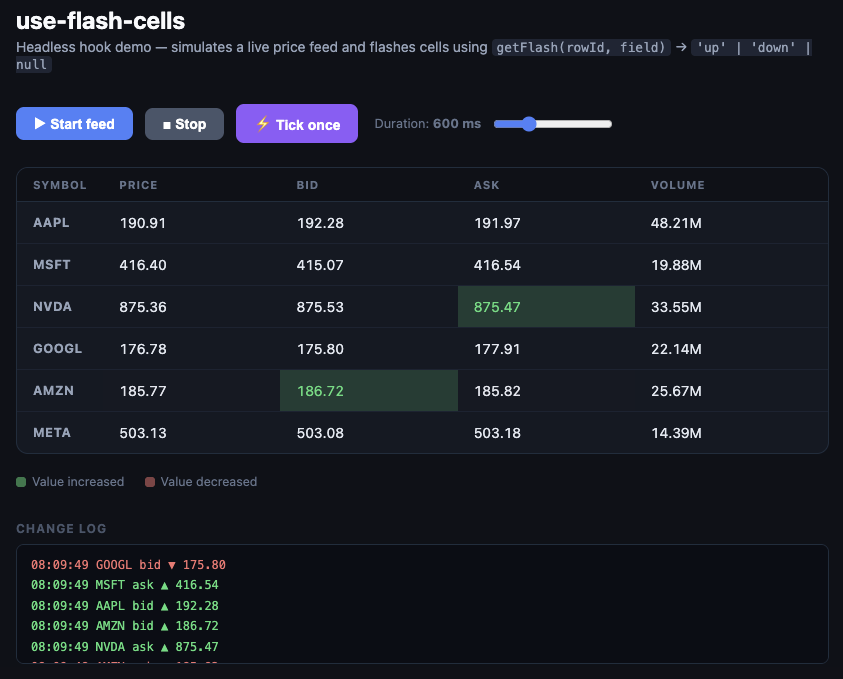

# use-flash-cells

[](https://github.com/RomanFedytskyi/use-flash-cells/actions/workflows/ci.yml)
[](https://www.npmjs.com/package/use-flash-cells)
[](https://www.npmjs.com/package/use-flash-cells)
[](https://www.npmjs.com/package/use-flash-cells)
[](https://bundlephobia.com/package/use-flash-cells)
[](LICENSE)
[](https://doi.org/10.5281/zenodo.20798420)

> **Never write a DIY price-flash loop again.**

Headless React hook that tracks which cells in a data table changed value and exposes `'up' | 'down' | null` flash direction per cell — drops in alongside **MUI DataGrid**, **TanStack Table**, **react-data-grid**, or any other renderer in under 5 lines.

## Why this exists

Every financial table — price grids, order books, portfolio views — needs to flash cells green (value up) or red (value down) when live data arrives. This pattern is so standard it has its own name in trading UI: *price flash*.

None of the most popular React table libraries support it composably for the stacks most teams actually use:

| Library | Status | Evidence |
|---|---|---|
| **MUI DataGrid** (2.4 M weekly downloads) | ❌ Maintainers tell users to DIY | [#9748](https://github.com/mui/mui-x/issues/9748), [#8826](https://github.com/mui/mui-x/issues/8826) |
| **TanStack Table** (headless) | ❌ No value-change state at all | by design |
| **adazzle/react-data-grid** | ❌ Cell highlight is DIY | [#680](https://github.com/adazzle/react-data-grid/issues/680) |
| **AG Grid** | ✅ `enableCellChangeFlash` | only if you commit to AG Grid for everything |

The only dedicated package, [`@lab49/react-value-flash`](https://github.com/lab49/react-value-flash), wraps a **single number** in a component. It has no concept of a table, no row/field addressing, no `rowId`/`field` coordination, and its last release was December 2022 (13 stars, effectively abandoned).

**`use-flash-cells` fills the gap:** one headless hook that tracks your whole dataset, diffs previous vs. current values per cell, and returns `'up' | 'down' | null` — usable with any renderer.

## Install

```bash
npm install use-flash-cells
# or
yarn add use-flash-cells
# or
pnpm add use-flash-cells
```

**Peer dependency:** `react >= 16.8`  
**Runtime dependencies:** none  
**Bundle size:** < 1 KB gzipped

## Demo

Open `demo/index.html` in a browser — no build step required.

It simulates a live price feed across 6 ticker symbols and flashes cells in real time using the same logic as the hook. Use **▶ Start feed** to stream ticks at 400 ms intervals, **⚡ Tick once** to step manually, and the duration slider to see how different flash durations feel.



## Quick start

```ts
import { useFlashCells } from 'use-flash-cells'

const { getFlash } = useFlashCells(rows, {
  keyField: 'id',                     // uniquely identifies each row
  fields: ['price', 'bid', 'ask'],    // numeric fields to watch
  duration: 600,                      // ms flash stays visible (default: 600)
})

// In any cell renderer:
const dir = getFlash(row.id, 'price') // → 'up' | 'down' | null
```

## Usage

### MUI DataGrid

MUI's own maintainers have closed two separate requests for this feature with *"you should have all the pieces to implement that functionality"* ([#9748](https://github.com/mui/mui-x/issues/9748), [#8826](https://github.com/mui/mui-x/issues/8826)). `use-flash-cells` is those pieces, assembled.

```tsx
import { useFlashCells } from 'use-flash-cells'
import { DataGrid, GridColDef } from '@mui/x-data-grid'

interface Tick {
  symbol: string
  price: number
  bid: number
  ask: number
}

function PriceGrid({ rows }: { rows: Tick[] }) {
  const { getFlash } = useFlashCells(rows, {
    keyField: 'symbol',
    fields: ['price', 'bid', 'ask'],
    duration: 600,
  })

  const columns: GridColDef<Tick>[] = [
    { field: 'symbol', headerName: 'Symbol', width: 100 },
    {
      field: 'price',
      headerName: 'Price',
      width: 120,
      renderCell: ({ row, value }) => {
        const dir = getFlash(row.symbol, 'price')
        return (
          <span
            style={{
              background:
                dir === 'up'   ? '#d4f7d4' :
                dir === 'down' ? '#f7d4d4' : 'transparent',
              transition: 'background 0.3s ease',
              display: 'block',
              width: '100%',
              padding: '0 8px',
            }}
          >
            {value}
          </span>
        )
      },
    },
  ]

  return <DataGrid rows={rows} columns={columns} getRowId={r => r.symbol} />
}
```

### TanStack Table

```tsx
import { useFlashCells } from 'use-flash-cells'
import {
  createColumnHelper,
  useReactTable,
  getCoreRowModel,
  flexRender,
} from '@tanstack/react-table'

interface Tick { id: string; price: number; volume: number }

function PriceTable({ data }: { data: Tick[] }) {
  const { getFlash } = useFlashCells(data, {
    keyField: 'id',
    fields: ['price', 'volume'],
  })

  const columnHelper = createColumnHelper<Tick>()
  const columns = [
    columnHelper.accessor('price', {
      cell: ({ row, getValue }) => {
        const dir = getFlash(row.original.id, 'price')
        return (
          <span className={dir ? `flash flash--${dir}` : undefined}>
            {getValue()}
          </span>
        )
      },
    }),
  ]

  const table = useReactTable({
    data,
    columns,
    getCoreRowModel: getCoreRowModel(),
  })

  return (
    <table>
      <tbody>
        {table.getRowModel().rows.map(row => (
          <tr key={row.id}>
            {row.getVisibleCells().map(cell => (
              <td key={cell.id}>
                {flexRender(cell.column.columnDef.cell, cell.getContext())}
              </td>
            ))}
          </tr>
        ))}
      </tbody>
    </table>
  )
}
```

CSS to go with the className approach:
```css
.flash { transition: background 0.3s ease; }
.flash--up   { background: #d4f7d4; }
.flash--down { background: #f7d4d4; }
```

### adazzle/react-data-grid

```tsx
import { useFlashCells } from 'use-flash-cells'
import DataGrid from 'react-data-grid'

function PriceGrid({ rows }: { rows: Tick[] }) {
  const { getFlash } = useFlashCells(rows, {
    keyField: 'id',
    fields: ['price'],
  })

  const columns = [
    {
      key: 'price',
      name: 'Price',
      renderCell: ({ row }: { row: Tick }) => {
        const dir = getFlash(row.id, 'price')
        return (
          <span style={{ color: dir === 'up' ? 'green' : dir === 'down' ? 'red' : 'inherit' }}>
            {row.price}
          </span>
        )
      },
    },
  ]

  return <DataGrid rows={rows} columns={columns} />
}
```

## API

### `useFlashCells(data, options)`

```ts
import { useFlashCells } from 'use-flash-cells'

function useFlashCells<T>(
  data: T[],
  options: {
    keyField: keyof T              // field that uniquely identifies each row
    fields: ReadonlyArray<keyof T> // numeric fields to watch; accepts as const arrays
    duration?: number              // ms flash stays visible — default: 600
  }
): {
  getFlash: (rowId: string | number, field: keyof T) => FlashDirection
}
```

### `FlashDirection`

```ts
import type { FlashDirection } from 'use-flash-cells'

type FlashDirection = 'up' | 'down' | null
```

### Behaviour guarantees

| Scenario | Result |
|---|---|
| First render | All cells return `null` — no previous snapshot to compare |
| Value increases | `'up'` |
| Value decreases | `'down'` |
| Value unchanged | `null` |
| New row appears | `null` — only flashes on the *next* change |
| Rapid updates to same cell | Timer resets — full `duration` ms after the *latest* change |
| Unmount | All pending timers cancelled |
| No actual value changes | Zero `setState` calls — no wasted re-renders |
| Field value is `undefined` / non-numeric | `null` — NaN-safe comparison prevents spurious flashes |
| Row removed mid-flash | No crash — pending timer clears gracefully |

## Styling recipes

`getFlash` returns a plain string — use it however fits your design system:

```tsx
// Tailwind
<td className={dir === 'up' ? 'bg-green-100' : dir === 'down' ? 'bg-red-100' : ''} />

// CSS Modules
<td className={dir ? styles[`flash_${dir}`] : ''} />

// CSS variables
<td style={{ '--flash-bg': dir === 'up' ? '#d4f7d4' : dir === 'down' ? '#f7d4d4' : 'transparent' } as React.CSSProperties} />

// Inline
<td style={{ background: dir === 'up' ? '#d4f7d4' : dir === 'down' ? '#f7d4d4' : '' }} />
```

## Non-goals

This is **flash-state tracking only**. It deliberately does not include:

- **No rendering** — returns state only; you own the DOM.
- **No styles** — nothing injected; bring your own CSS.
- **No formatting** — pair with `Intl.NumberFormat` or `currency.js`.
- **Not a table component** — composes with whatever you already use.
- **No data fetching / WebSocket** — you supply the data, the hook diffs it.

## Comparison

| | `use-flash-cells` | `@lab49/react-value-flash` | AG Grid built-in |
|---|---|---|---|
| Table-level (all rows/fields) | ✅ | ❌ single cell only | ✅ |
| Headless / renderer-agnostic | ✅ | ❌ React component | ❌ AG Grid only |
| Works with MUI DataGrid | ✅ | ⚠️ manual wrap per cell | ❌ |
| Works with TanStack Table | ✅ | ⚠️ manual wrap per cell | ❌ |
| Actively maintained | ✅ | ❌ last release Dec 2022 | ✅ |
| Zero runtime dependencies | ✅ | ❌ | ❌ |
| Bundle size | < 1 KB gz | ~3 KB gz | ~300 KB+ |

## Reproduce the results

```bash
git clone https://github.com/RomanFedytskyi/use-flash-cells
cd use-flash-cells
npm ci
npm run typecheck   # tsc --noEmit
npm test            # vitest: 30 tests (13 unit + 17 stress/edge-case)
npm run build       # tsup → dual ESM + CJS + .d.ts
```

CI matrix: Node 18 / 20 / 22.

## Contributing

Bug reports and pull requests are welcome. Please open an issue before sending a large PR.

## Citation

If you use this package in academic work or want to cite a specific version, please use the DOI:

```bibtex
@software{fedytskyi_2026_use_flash_cells,
  author    = {Fedytskyi, Roman},
  title     = {use-flash-cells},
  version   = {1.0.0},
  year      = {2026},
  doi       = {10.5281/zenodo.20798420},
  url       = {https://github.com/RomanFedytskyi/use-flash-cells},
  license   = {MIT}
}
```

Or in APA format:

> Fedytskyi, R. (2026). *use-flash-cells* (v1.0.0). Zenodo. https://doi.org/10.5281/zenodo.20798420

## License

MIT — see [LICENSE](LICENSE).
